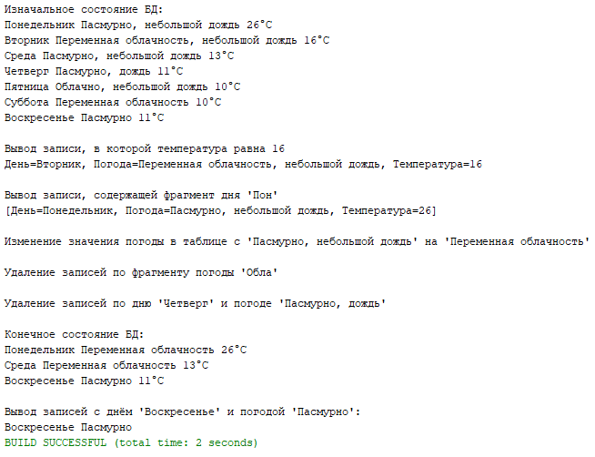

# BMK01_Lab03 Spring_Beans

Решение 3 лабараторной работы.<br/>
Вариант - 1 (погода).<br/>
Реализация программы с использованием технологии Spring Framework и базы данных



```
CREATE TABLE IF NOT EXISTS `weather` (
    `id` INT NOT NULL AUTO_INCREMENT,
    `day` VARCHAR(45) NULL DEFAULT NULL,
    `forecast` VARCHAR(45) NULL DEFAULT NULL,
    `temperature` INT NULL DEFAULT NULL,
    PRIMARY KEY (`id`)
)  ENGINE=INNODB DEFAULT CHARSET=UTF8;
```
